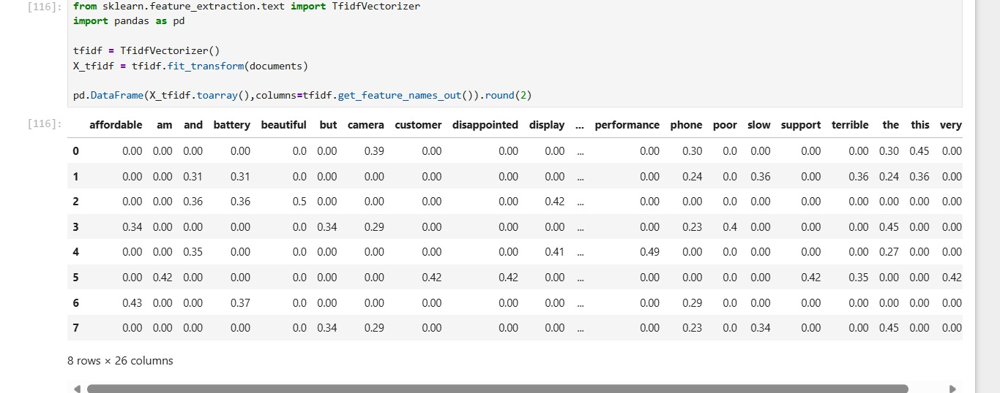
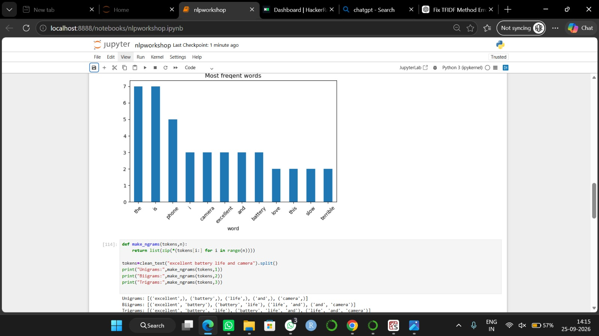

# NLP Workshop
Hands-on Natural Language Processing projects completed during an NLP workshop on September 25, 2026.

## 📚 Topics Covered

- Text preprocessing
- TF-IDF Vectorization
- Sentiment Analysis
- Logistic Regression
- Text Classification
- Classification Report
- Confusion Matrix
- Prediction Probabilities
- Cosine Similarity
- FAQ Question Similarity

## 🚀 Projects

### 1. Sentiment Analysis

A machine learning model that classifies phone reviews as either
**positive** or **negative**.

**Technologies:**
- Python
- Pandas
- Scikit-learn
- TF-IDF
- Logistic Regression
- Matplotlib

### 2. FAQ Similarity

A simple NLP system that compares a user's question with existing
FAQ questions using **TF-IDF and Cosine Similarity**.

## 🛠️ Technologies Used

- Python
- Pandas
- Scikit-learn
- Matplotlib

## 📊 Workshop Results

### TF-IDF Feature Matrix

### Word Frequency and N-grams

### Word Frequency and N-grams

